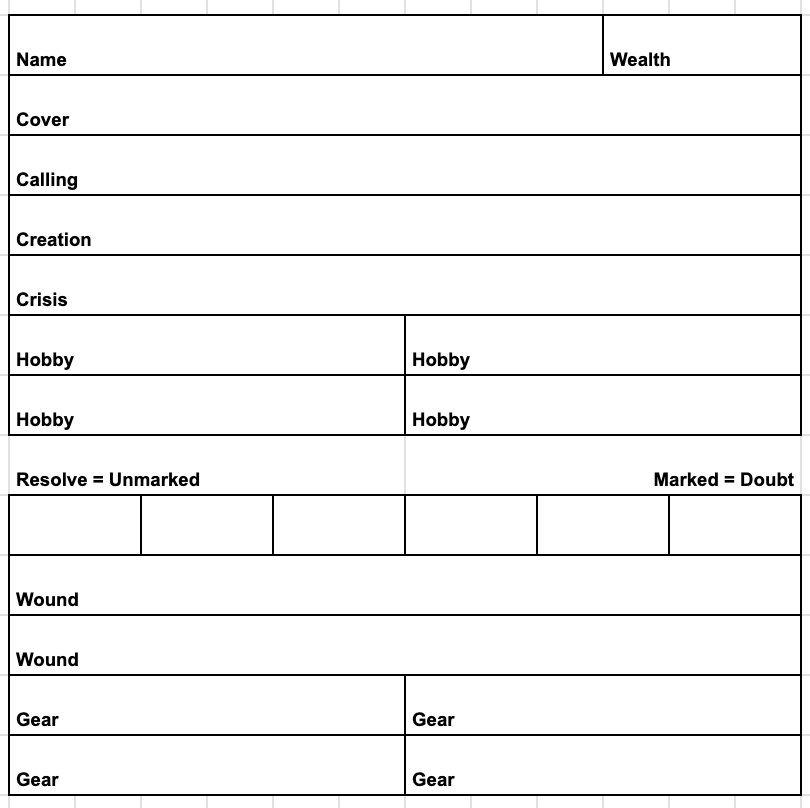
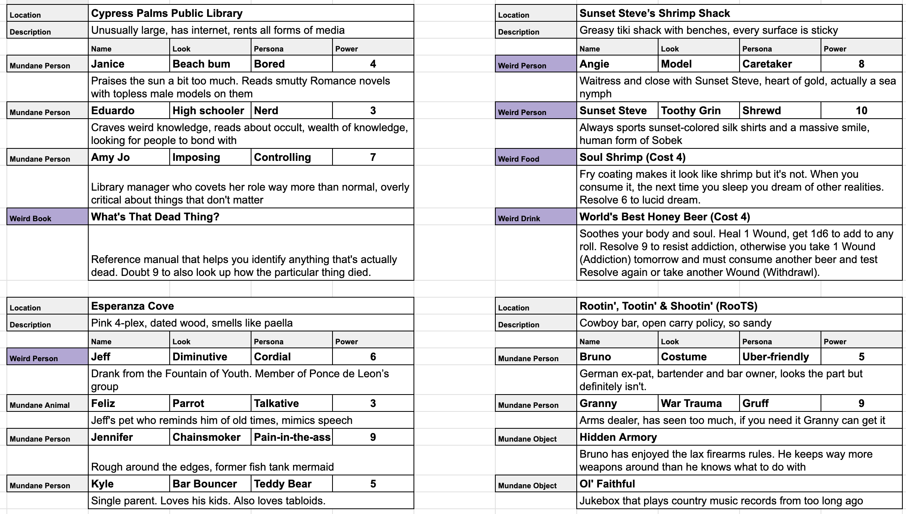

# Beachcombers

Built off of Resolve Core. https://github.com/rwinslow/resolve

* Supernatural, weird Florida in the 1990s
* You play a supernaturally sensitive individual who works odd jobs to pay the bills. Your real calling is the weird and mysterious.
* This is designed to be as serious (more Stranger Things) or silly (more WWDITS) as you want.
* Tropes
  * SCP-style weirdness in a tropical, beachy location
  * Voodoo, stolen idols, native peoples against colonialism, storms and weather, folklore
  * Cajun, Spanish, Hawaiian, islander influence
  * What We Do in the Shadows crossed with Miami Vice

## Inspiration

* Reno 911\!
* Eerie, Indiana
* Are You Afraid of the Dark?
* Tales from the Crypt
* The Outer Limits
* Twilight Zone
* Stranger Things
* What We Do In The Shadows
* Miami Vice

## Building a Character

* Calling (Background)
  * Voodoo
  * Psychic
  * Oracle
  * Witch
  * Conjurer
  * Medium
  * Occultist
  * Necromancer
  * Warlock
  * Cultist
  * Exorcist
  * Alchemist
  * Druid
* Cover (Profession)
  * Fisherman
  * Line Cook
  * Housekeeper
  * Mechanic
  * Custodian
  * Scuba Diver
  * Taxi Driver
  * Tour Guide
  * Bartender
  * Groundskeeper
  * Shopkeeper
  * Postal Carrier
  * Animal Trainer
  * Esthetician
  * Lifeguard
  * Airboat Captain
  * Paddleboard Instructor
  * Toll Booth Operator
  * Restaurant Server
  * Golf Caddy
  * Yoga Instructor
  * Garbage Man
* Hobbies (Skills)
  * Influencer
  * Boxer
  * Hacker
  * Driver
  * Weightlifter
  * Runner
  * Historian
  * Hunter
  * Artist
  * Musician
  * Handyman/Woman
  * Author
  * Yogi
  * Swimmer
  * Jewelry Maker
  * Costumer
  * Carpenter
  * Furniture Builder
* PC additions
  * Creation - Write down how you gained your calling
  * Crisis - Write down what went wrong while practicing your calling

**Weird**

Spells, rituals, and objects of power may have a requirement to activate. The item description details whether it requires a Resolve or Doubt roll.

- Voodoo Doll + Personal item from your target - Give one Wound. Target’s personal item turns to ash after an attempt. Roll Doubt. On a 6, the personal item does not turn to ash and can be reused.
- Skull Candle - Allow a spirit to possess you until the candle melts through and goes out. Roll Resolve. On a 6, you can expunge the spirit whenever you want.
- Tide Pod - Take one harm, then go berserk with pure insanity. For some reason your clothes are now shredded into tatters. Roll Doubt. On a 5+ you take no harm. Life has done enough to you.
- Gator Claw - Merges with your hand for 1 week. Does 3 Wounds when attacking with bare hands. Roll Resolve. On 5+, you can take it off any time you want within that week.
- Box of Void Crayons (3 in the box) - Roll 1d6 to determine which one you pull out
  - Red - summons a creature when their name is written
  - Orange - draw a door that leads to a known location
  - Yellow - produces an invisible message only recipient can see and read
  - Green - writes the true name of a known creature
  - Blue - conjures what you need, not what you want
  - Violet - draw a circle to open a portal to an unknown plane of existence
- Tamagotchi Phylactery - Some dark spirit inhabits the device. If you feed it what it wants daily, it just might help you when you need it. Roll Doubt. On 5+ it tells you something you need to know, even if you don’t want to.
- Souvenir Shot Glass from Nowhere - Says “Pompano Beach” but the imagery is definitely not Pompano Beach. If you drink rum from it and you remember a vacation you never took. The memories get more specific each time. Roll Doubt, Success = Your memories have another inhabitant who is telling you things relevant for today. Déjà vu. Fail or Cost = You take Wound "Drunk on nostalgia"
- Blockbuster VHS Training Tape - The Blockbuster in the video is of a liminal space with infinite rows of videos of films that never existed. The trainees know what film you should watch. Cannot be rewound.
- Blockbuster Membership Card - Member since '94. Lets you "check out" up to three memories from anyone you touch. You have to return them by touching the person within 48 hours or pay late fees in years of your life. Roll Resolve. Success = They are automatically returned via ephemeral rewind. Cost = Highest Bond loses 1 Rank, some of your own memories are rewound too.
- Treasure Island Scratch-off Ticket - When you receive it, it suspiciously expires in 5 minutes. Roll Resolve. On a 6, Wealth increases by 2.
- Early Bird Special Menu - Says “One item per customer” at the bottom. Instead of entrees, it’s dark knowledge with a cost.
- Bingo Ball Cage - No matter how many balls are in it and what the numbers are, the number 8 is all it ever produces.
- Splash Mountain Poncho - Disposable. Makes you totally forgettable in the rain.
- Polaroid of a Cryptid - When you flap the photo back and forth while thinking of your target cryptid, it’s revealed with enough information in the background to identify where its hiding place is. Roll Resolve. On 4+, you also find out exactly where it is at that moment.
- I-4 Dead Zone Toll Receipt - From the stretch between Orlando and Tampa where cell phones drop and accidents cluster. Burn it to create a zone of mechanical failure. Electronics die, engines stall, the modern world takes a coffee break.
- Bingo Dauber of Fortune - From a 55+ community bingo night. Dab it on any document to reveal what's hidden or redacted. Ink smells like cigarettes and desperation.
- Stuck Emergency Radio - Makes noise whenever danger lurks nearby. Roll Resolve. On 5+, a mysterious voice reveals an important detail about the danger.
- Mood Ring - Changes color based on the emotions of nearby entities, not you. When it turns black, something nearby is experiencing existential dread. The strongest emotion dominates.
- The Walkman of Regrets - Plays mixtapes recorded by your past selves in other timelines. Each tape reveals one decision you made differently. Rewind at your own risk.
- AOL Free Trial CD - Installing it connects you to a chatroom where something pretending to be people tries to learn how to be human.
- Goldtone Sunscreen - Reflects ultra psychic rays. You’re a golden mirror.
- Hoakley Sunglasses - You can now see mysterious entities in your peripheral vision. Just a glance at what’s following everyone’s back.
- Toaster oven - Makes perfect toast for your meal no matter ear the settings are. Roll Resolve. On 3+, your toast mysteriously arrives with your favorite cheese melted on top.
- Oven mitts - Touch ghostly things without getting hurt
- Instant coffee - Get pepped. No sleep for 72 hours. So much time for activities. You know you’re gonna crash hard when it wears off and take 1 Wound afterward. Roll Resolve. On 6, you to suffer no ill effects.
- Photo frame - When you place a picture in it, reveals the true form of the creatures in the photo
- Rabbit’s foot - Throw it to sic violent bunnies on a creature.
- Velcro wallet - So loud and unfashionable. Doubt 9, you can count to three before it goes off.
- Cassette tape - A mixtape of the favorite songs of whoever plays it.  When you play it backwards it’s a message from your future self.

## Gear

* Knife
* Clothes
* Car
* Rollerblades
* AM/FM Radio
* Walkie Talkie
* Pager
* Pistol
* Shotgun
* Rifle
* Grenade
* Leather Jacket
* Pool Cue
* Chain
* Halloween Mask
* Ouija Board
* Chalk
* Bag of Marbles
* Dog Treats
* Instant Camera
* Bicycle
* Screwdriver

## Bestiary

* Everlasting coconut
  * Never stops dripping coconut milk. Takes 1 month to drip enough to produce a glass.
* Drink the glass of coconut milk
  * Heal a wound and gain otherworldly insight into whatever you’re pursuing. Resolve 9 to prevent what you’re pursuing from noticing you scrying.
* Upside down pineapple plant
  * Makes people swingers and gives them a random STD. They are compelled and cannot help “engaging” with others who have consumed the pineapple
* Augustus
  * Vampire surfer, like Lazlo, hunting sharks in the water at night
* Terry
  * Rollerblading werewolf.
* Mystical dog collar summons the epitome of a dog. Reusable. Resolve 9 to cast
* Sand Yogi
  * Emotional well. Helps you relieve stress. Relieve 2 Doubt. Describe your painful memory.
* Bougainvile.
  * Overgrown bougainvillea, controlled by a sentient fungus. Carnivorous. Hungry. Thorny.
* Carl
  * Zombie make up artist who is so good he can make himself look like he’s alive
* Carlotta
  *  Public access channel psychic. Thinks she has powers. Doesn’t.
* Clasped Hands.
  * Cult led by Cervantes. Worships him as a god, and he actually is. Trying to expand his influence. Promises his members everlasting life. Wants to absorb the consciousness of them so he can go back to sleep and have others to share his dreams with. Was bored with the last group after a millennia of slumber.
* Mother October.
  * Conjurer who keeps tabs on cult activity in the area. Her services don’t come free, but she is always on your side.
* Sister March.
  * Apprentice of October. Has innate talent for conjuring. Rough upbringing until October adopted her.
* Gary Wissler.
  * Obsessed with finding the backrooms. Got a glimpse when he was a teen and heard whispers from a mysterious voice to come and find him. Never stopped looking.
* Jeff
  * Conquistador that drank from the fountain of youth. Was part of Ponce de Leon’s group. Landlord of a small 4-plex apartment.
* Angie
  * Waitress at Sunset Steve’s Shrimp Shack. Small town model with a heart of gold. Actually a sea nymph.
* Sunset Steve
  * Portly restaurateur who always sports sunset colored silk shirts and a massive toothy grin. Human form of Sobek

## GM

Set a threshold to determine how normal things are in your setting. A threshold of 1 means almost nothing is normal, to 6 meaning everything is normal.

* Set a threshold for your level of weirdness.
* When you don’t know if the result of something is weird, roll a d6.
* Any result at or over that value results in a weird outcome, attribute, item, or anything else.

Creating weird objects

* Type
* Effect
* Scope
* Danger

Making each adventure like an episode of a TV show

* Setup - Discover threat
* Conflict/Rising Action - Gather information, small skirmishes, nearly encounter the threat
* Climax - Threat is directly challenged
* Resolution - Recovery and downtime

How do the PCs find out about new threats?

1. Local Tabloid
2. A bond is affected
3. Evening News report
4. Community member notes something weird
5. Omen appears
6. Threat takes a clear and direct action

